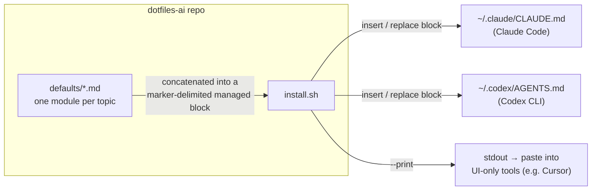

# Architecture

dotfiles-ai has two moving parts: a set of preference modules and an
installer that assembles them into the instruction files AI coding tools
read at the user level.

## Components

- **`defaults/`** — the content. Each file is one self-contained,
  tool-agnostic preference module written as direct instructions to an
  assistant. Modules are independent; the installer includes all of them
  in filename order.
- **`install.sh`** — the delivery mechanism. It concatenates the modules
  between `BEGIN`/`END` HTML-comment markers and inserts that block into
  each target file. Re-runs replace only the managed block (backing up the
  file first), so user content outside the markers is never touched.
  Targets are a plain list in the script — adding a tool means adding a
  path there.

## Key invariant

The generated block in target files is disposable: the source of truth is
always `defaults/`. Edits belong in this repo, followed by a re-run of
`install.sh` — never in the installed files directly.
