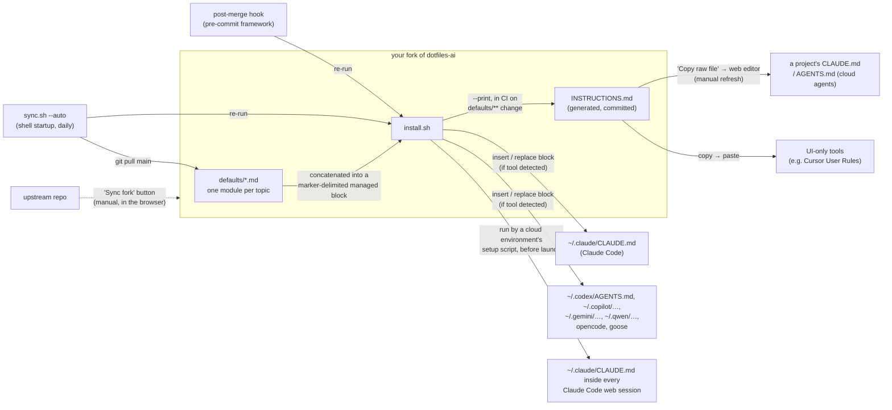

# Architecture

This describes one implementation of an unsettled problem — see
[Status: experimental](README.md#status-experimental) in the README, and the
[decision records](adr/) for the options weighed against it.

dotfiles-ai has two moving parts: a set of preference modules and an
installer that assembles them into the instruction files AI coding tools
read at the user level. The same assembled block is also committed to the
repo as `INSTRUCTIONS.md`, which gives a second delivery path that needs no
terminal at all.

Users are expected to work from a **fork** — the modules are personal
preferences meant to be edited, and every copy (machines, project repos)
syncs from the repo that user controls. Upstream reaches a fork only through
GitHub's *Sync fork* button.

## Components

- **`defaults/`** — the content: flat `.md` files, one self-contained,
  tool-agnostic preference module each, written as direct instructions to
  an assistant. Modules are independent; the installer includes all of them
  in filename order. Modules are also grouped into four documentation
  categories — collaboration, craft, delivery, documentation — but that
  grouping lives in the README and the website only, deliberately not in
  the directory layout, so adding a module stays a one-file drop.
- **`install.sh`** — the delivery mechanism. It concatenates the modules
  between `BEGIN`/`END` HTML-comment markers and inserts that block into
  each target file. Re-runs replace only the managed block (backing up the
  file first), so user content outside the markers is never touched.
  Targets are a plain list in the script — adding a tool means adding a
  path there. A target is skipped unless its tool's config directory
  already exists (`--all` overrides), so only tools actually in use get
  instruction files. Which *modules* go into the block is also selectable
  (`--list`, `--only`, `--except`, `--all-modules`): the set is one person's
  opinions and a take-it-whole set is one most people bounce off. A selection
  is saved to `~/.local/state/dotfiles-ai/modules` rather than to the repo,
  because `sync.sh` re-runs the installer unattended — a choice that did not
  persist would be silently reverted within a day — while the repo-level way
  to curate stays "delete the module from your fork".
- **`INSTRUCTIONS.md`** — the assembled block, committed at the repo root as
  a build artifact of `install.sh --print`. Generated, never hand-edited, and
  regenerated in the same change that edits a module — along with
  `INSTRUCTIONS-brief.md` and the site's module text. **`test.sh`** fails when
  any of the three differs from what the installer produces, so staleness is
  caught by the same gate as everything else rather than repaired afterwards
  by a workflow pushing to `main`. Its consumers
  copy it by hand (web editor, settings fields), so it is a snapshot
  wherever it lands, refreshed by replacing the marker-delimited block.
- **`test.sh`** — the acceptance scenarios from `specs/001-user-level-install`
  made executable: each case builds a throwaway `HOME`, runs `install.sh`
  against it, and asserts the outcome. No framework, no dependencies. Run by
  **`.github/workflows/test.yml`** on every push and pull request, so a
  regression fails the build instead of being discovered in someone's
  instruction file.
- **`docs/`** — the project website (static HTML/CSS, no generator),
  published to GitHub Pages by **`.github/workflows/deploy-pages.yml`**
  (`actions/deploy-pages`) on merges to `main` that touch `docs/`.
  Terminal output shown there is simulated and labeled as such. The page is
  hand-written except for one generated region per module — see
  `build-site.sh` below — so it is edited directly, then rebuilt.
- **`build-site.sh`** — the site's only build step. Each module card on the
  website carries a summary, then the module's **exact text**, then a
  before/after example; this script fills the middle part, copying every
  `defaults/*.md` verbatim into its card between per-module
  `BEGIN`/`END module-text` markers — the same technique `install.sh` uses on
  instruction files. It also fills the `data-gen` spans in the web-chat
  section with the measured sizes of both generated artifacts, and how far the
  full block overshoots each documented cap: hand-typed, those numbers were
  wrong within two changes of being written. It exists because the site previously paraphrased each
  module: a reader could not see what would actually be installed, and the
  paraphrase drifted the moment the module changed. `--check` exits non-zero
  when the page is stale, and `test.sh` runs it, so drift fails the build.
- **`sync.sh`** — propagation. Pulls the latest `main` (fast-forward only)
  and re-runs the installer. In `--auto` mode (meant for shell startup) it
  throttles to one attempt per day via a stamp file in
  `~/.local/state/dotfiles-ai/`, tracks the last-installed commit so a
  fresh machine installs on first run, and stays silent when offline or
  already current. It also runs `pre-commit install` (when available) so
  the framework's commit and post-merge hooks are active on the machine.
- **`.pre-commit-config.yaml`** — secret/PII gate on every commit via the
  standard pre-commit framework: official gitleaks hook (custom PII rules
  extend the defaults in **`.gitleaks.toml`**), `detect-private-key`,
  `detect-aws-credentials`, plus a local post-merge hook that re-runs
  `install.sh` after pulls (replacing the old `core.hooksPath` approach).
  Backed up by **`.github/workflows/secret-scan.yml`**, which runs
  gitleaks in CI on every push/PR, and by GitHub secret scanning + push
  protection in repo settings.
- **`adr/`** — architecture decision records: why the project is shaped this
  way, which alternatives were weighed (native per-tool config, a generic
  dotfiles manager, `rulesync`, `AGENTS.md`, Claude Code auto memory, a
  vendor plugin), and the conditions that should reopen each decision. Start
  at [`adr/0001`](adr/0001-forkable-repo-for-personal-ai-preferences.md).
- **`specs/`** — intended behavior in Spec Kit format, one directory per
  capability (`install.sh`, `sync.sh`, `INSTRUCTIONS.md` generation), each a
  `spec.md` of user stories, functional requirements, and success criteria.
  Written retroactively from the code, so there are no `plan.md` / `tasks.md`
  alongside them; from here they are revised in the same change as the
  behavior they describe. Project-wide principles live in
  **`.specify/memory/constitution.md`**. This is the `specification` module
  applied to this repo — see `specs/README.md`.
- **`infra/`** — GitHub repository settings as code (Terraform, official
  GitHub provider): description, merge policy, Pages source, vulnerability
  alerts, secret scanning + push protection, and branch protection on `main`
  (required `test` check, administrators included, branches must be current). The `repo-config` module makes
  the Settings GitHub App the default and Terraform the exception; this repo
  is the exception, and for the reason the module names — three of the
  settings above (Pages `build_type`, secret scanning, push protection) have
  no key in `.github/settings.yml`, so moving here would hand exactly those
  back to the web UI. An `import` block adopts the
  existing repo; state stays local and is gitignored. Applied by
  **`.github/workflows/repo-settings.yml`** on merges to `main` touching
  `infra/` (stateless: re-import, reconcile, discard state), using a
  fine-grained admin PAT in the `REPO_ADMIN_TOKEN` secret; skips with a
  notice when the secret is absent. The same workflow runs weekly in
  check-only mode: it plans, reports which settings differ, and fails without
  applying, because applying on change alone leaves the config unverified
  between edits. The plan covers every declared setting, including the three
  (Pages `build_type`, secret scanning, push protection) that cannot be read
  back without an admin token.

## Propagation paths

Three copies of the block exist downstream of a fork's `defaults/`, and each
is refreshed by a different mechanism:

| Copy | Refreshed by | Trigger |
|---|---|---|
| The fork itself | GitHub *Sync fork* | manual, one click |
| User-level files on a machine | `sync.sh` → `install.sh` | automatic (daily / post-merge) |
| `~/.claude/CLAUDE.md` in a cloud session | environment setup script → `install.sh` | on environment cache rebuild |
| A project repo's `CLAUDE.md` / `AGENTS.md` | re-copy `INSTRUCTIONS.md`, replace the block | manual |

The cloud-session copy reuses `install.sh` unchanged: a Claude Code on the web
environment can run a setup script as root before the session launches, and
its writes to disk persist, so the same script that provisions a laptop
provisions a container. Because that result is snapshot-cached per
environment, it lags `defaults/` until the cache rebuilds.

The last one is deliberately manual: those files are shared with a project's
collaborators, so no scheduled bot rewrites them.

## Key invariant

The generated block in target files is disposable: the source of truth is
always `defaults/`. Edits belong in this repo, followed by a re-run of
`install.sh` — never in the installed files directly. `INSTRUCTIONS.md` is
the same kind of artifact, one commit deep: it is generated from `defaults/`
by CI, so editing it directly is always wrong. The module text inside
`docs/index.html` is the same kind of artifact: written by `build-site.sh`,
never by hand.
