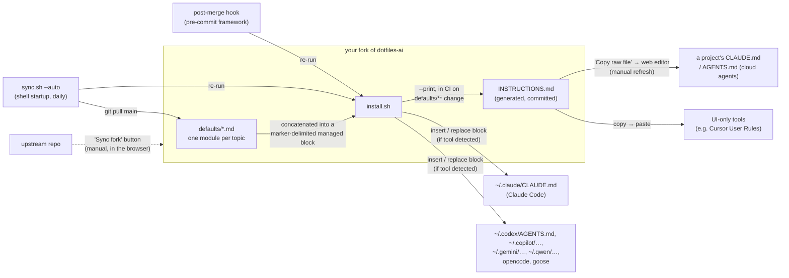

# Architecture

dotfiles-ai has two moving parts: a set of preference modules and an
installer that assembles them into the instruction files AI coding tools
read at the user level. The same assembled block is also committed to the
repo as `INSTRUCTIONS.md`, which gives a second delivery path that needs no
terminal at all.

Users are expected to work from a **fork** — the modules are personal
preferences meant to be edited, and every copy (machines, project repos)
syncs from the repo that user controls. Upstream reaches a fork only through
GitHub's *Sync fork* button.

## Components

- **`defaults/`** — the content: flat `.md` files, one self-contained,
  tool-agnostic preference module each, written as direct instructions to
  an assistant. Modules are independent; the installer includes all of them
  in filename order. Modules are also grouped into four documentation
  categories — collaboration, craft, delivery, documentation — but that
  grouping lives in the README and the website only, deliberately not in
  the directory layout, so adding a module stays a one-file drop.
- **`install.sh`** — the delivery mechanism. It concatenates the modules
  between `BEGIN`/`END` HTML-comment markers and inserts that block into
  each target file. Re-runs replace only the managed block (backing up the
  file first), so user content outside the markers is never touched.
  Targets are a plain list in the script — adding a tool means adding a
  path there. A target is skipped unless its tool's config directory
  already exists (`--all` overrides), so only tools actually in use get
  instruction files.
- **`INSTRUCTIONS.md`** — the assembled block, committed at the repo root as
  a build artifact of `install.sh --print`. Generated, never hand-edited:
  **`.github/workflows/generate-instructions.yml`** regenerates and commits
  it whenever `defaults/**` (or `install.sh`) changes on `main`. It lives in
  CI rather than in a local pre-commit hook on purpose — modules edited
  through the GitHub web editor have no local hook to run, and the
  no-terminal install path depends on this file being current. Its consumers
  copy it by hand (web editor, settings fields), so it is a snapshot
  wherever it lands, refreshed by replacing the marker-delimited block.
- **`docs/`** — the project website (static HTML/CSS, no generator),
  published to GitHub Pages by **`.github/workflows/deploy-pages.yml`**
  (`actions/deploy-pages`) on merges to `main` that touch `docs/`.
  Terminal output shown there is simulated and labeled as such.
- **`sync.sh`** — propagation. Pulls the latest `main` (fast-forward only)
  and re-runs the installer. In `--auto` mode (meant for shell startup) it
  throttles to one attempt per day via a stamp file in
  `~/.local/state/dotfiles-ai/`, tracks the last-installed commit so a
  fresh machine installs on first run, and stays silent when offline or
  already current. It also runs `pre-commit install` (when available) so
  the framework's commit and post-merge hooks are active on the machine.
- **`.pre-commit-config.yaml`** — secret/PII gate on every commit via the
  standard pre-commit framework: official gitleaks hook (custom PII rules
  extend the defaults in **`.gitleaks.toml`**), `detect-private-key`,
  `detect-aws-credentials`, plus a local post-merge hook that re-runs
  `install.sh` after pulls (replacing the old `core.hooksPath` approach).
  Backed up by **`.github/workflows/secret-scan.yml`**, which runs
  gitleaks in CI on every push/PR, and by GitHub secret scanning + push
  protection in repo settings.
- **`infra/`** — GitHub repository settings as code (Terraform, official
  GitHub provider): description, merge policy, Pages source, vulnerability
  alerts, secret scanning + push protection. An `import` block adopts the
  existing repo; state stays local and is gitignored. Applied by
  **`.github/workflows/repo-settings.yml`** on merges to `main` touching
  `infra/` (stateless: re-import, reconcile, discard state), using a
  fine-grained admin PAT in the `REPO_ADMIN_TOKEN` secret; skips with a
  notice when the secret is absent.

## Propagation paths

Three copies of the block exist downstream of a fork's `defaults/`, and each
is refreshed by a different mechanism:

| Copy | Refreshed by | Trigger |
|---|---|---|
| The fork itself | GitHub *Sync fork* | manual, one click |
| User-level files on a machine | `sync.sh` → `install.sh` | automatic (daily / post-merge) |
| A project repo's `CLAUDE.md` / `AGENTS.md` | re-copy `INSTRUCTIONS.md`, replace the block | manual |

The last one is deliberately manual: those files are shared with a project's
collaborators, so no scheduled bot rewrites them.

## Key invariant

The generated block in target files is disposable: the source of truth is
always `defaults/`. Edits belong in this repo, followed by a re-run of
`install.sh` — never in the installed files directly. `INSTRUCTIONS.md` is
the same kind of artifact, one commit deep: it is generated from `defaults/`
by CI, so editing it directly is always wrong.
